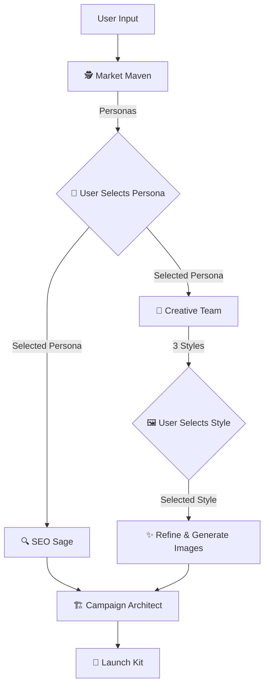

# 🚀 Souqra AI Marketing Strategist

<div align="center">
  
  <br/>
  <h3>Multi-Agent AI System for Automated Marketing Strategy Generation</h3>
</div>

---

## 📖 Overview

**Souqra** is an advanced, AI-powered platform designed to simulate a professional marketing agency. It orchestrates a team of specialized AI agents to take a raw product idea and transform it into a comprehensive, actionable **Marketing Launch Kit**.

Users simply provide a product description and business goals, and Souqra guides them through a step-by-step workflow involving market analysis, persona definition, SEO strategy, creative asset generation, and a final 30-day launch plan.

### 🌟 Key Features

*   **Multi-Agent Architecture:** Powered by **LangGraph**, simulating distinct roles:
    *   🕵️ **Market Maven:** Analyzes competitors & defines user personas.
    *   🔍 **SEO Sage:** Conducts keyword research & content strategy.
    *   🎨 **Creative Team (Wordsmith & Muse):** Generates ad copy & visual concepts.
    *   🏗️ **Campaign Architect:** Synthesizes everything into a launch plan.
*   **Human-in-the-Loop:** Users review and select the best personas and creative directions at key checkpoints.
*   **Structured Outputs:** Uses **Pydantic** to enforce strict JSON schemas, ensuring reliable and type-safe data flow.
*   **Modern Tech Stack:** Built with **FastAPI** (Backend) and **React + Vite + Tailwind CSS** (Frontend).
*   **AI Integration:** Compatible with **OpenAI** and **OpenRouter** (supports models like GPT-4o, Llama 3, etc.).

---

## 🏗️ Architecture

The system follows a **Human-in-the-Loop Workflow**:



---

## 🛠️ Tech Stack

### Backend
*   **Language:** Python 3.10+
*   **Framework:** FastAPI
*   **AI Orchestration:** LangGraph, LangChain
*   **Validation:** Pydantic V2
*   **Search Tool:** DuckDuckGo Search
*   **LLM Provider:** OpenRouter / OpenAI

### Frontend
*   **Framework:** React 18
*   **Build Tool:** Vite
*   **Styling:** Tailwind CSS
*   **Icons:** Heroicons
*   **State Management:** React `useReducer`

---

## 🚀 Getting Started

### Prerequisites
*   Node.js (v18+)
*   Python (v3.10+)
*   An API Key from **OpenRouter** or **OpenAI**.

### 1️⃣ Backend Setup

1.  Navigate to the backend folder:
    ```bash
    cd backend
    ```

2.  Create a virtual environment:
    ```bash
    python -m venv .venv
    source .venv/bin/activate  # On Windows: .venv\Scripts\activate
    ```

3.  Install dependencies:
    ```bash
    pip install -r requirements.txt
    ```

4.  Create a `.env` file in the `backend/` directory:
    ```ini
    # backend/.env
    OPENROUTER_API_KEY=sk-or-v1-your-key-here...
    # Optional: If using OpenAI directly
    # OPENAI_API_KEY=sk-...
    ```

5.  Run the server:
    ```bash
    uvicorn main:app --reload
    ```
    *Server will start at `http://127.0.0.1:8000`*

### 2️⃣ Frontend Setup

1.  Navigate to the frontend folder (new terminal):
    ```bash
    cd frontend
    ```

2.  Install dependencies:
    ```bash
    npm install
    ```

3.  Run the development server:
    ```bash
    npm run dev
    ```
    *App will be available at `http://localhost:3000`*

---

## 🎮 Usage Guide

1.  **Input:** Fill out the "Product Launch Brief" with your product name, USP, and goals.
2.  **Market Analysis:** The **Market Maven** will research and present 3 distinct target personas.
3.  **Selection 1:** Choose the persona that best fits your vision.
4.  **Generation:** The system runs **SEO Sage** (keywords) and **Creative Team** (3 visual/copy styles) in parallel.
5.  **Selection 2:** Review the 3 creative drafts (e.g., "Bold & Modern", "Professional"). Select one.
6.  **Refinement:** (Optional) Tweak the copy or generate real AI preview images using the integrated Pollinations.ai API.
7.  **Final Plan:** The **Campaign Architect** compiles everything into a downloadable JSON Launch Kit.

---

## 📂 Project Structure

```
├── backend/
│   ├── agents.py         # AI Agent logic and Tool definitions
│   ├── graph.py          # LangGraph state machine definition
│   ├── main.py           # FastAPI routes and server entry
│   ├── schemas.py        # Shared Pydantic data models
│   └── requirements.txt  # Python dependencies
│
└── frontend/
    ├── src/
    │   ├── components/   # React UI components (Forms, FeedbackLoop, etc.)
    │   ├── services/     # API client (api.ts) & Image generation
    │   ├── types.ts      # TypeScript interfaces matching Pydantic schemas
    │   └── App.tsx       # Main application flow
    └── package.json
```

---

## 🤝 Contributing

Contributions are welcome! Please open an issue or submit a pull request for any improvements or bug fixes.

---

## 📄 License

This project is licensed under the MIT License.
```

### How to use this:
1.  Create a file named `README.md` in the root of your project directory.
2.  Paste the content above into that file.
3.  You can replace the placeholder image URL with a screenshot of your actual running application for better presentation.